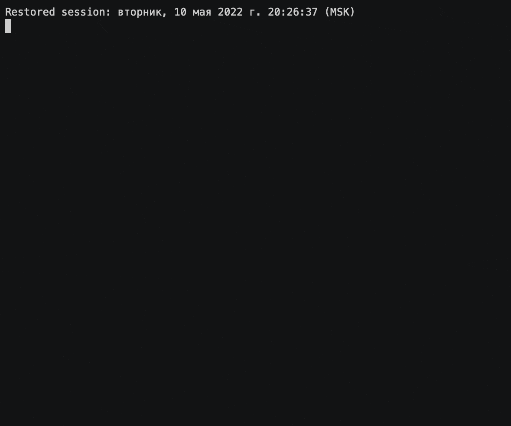
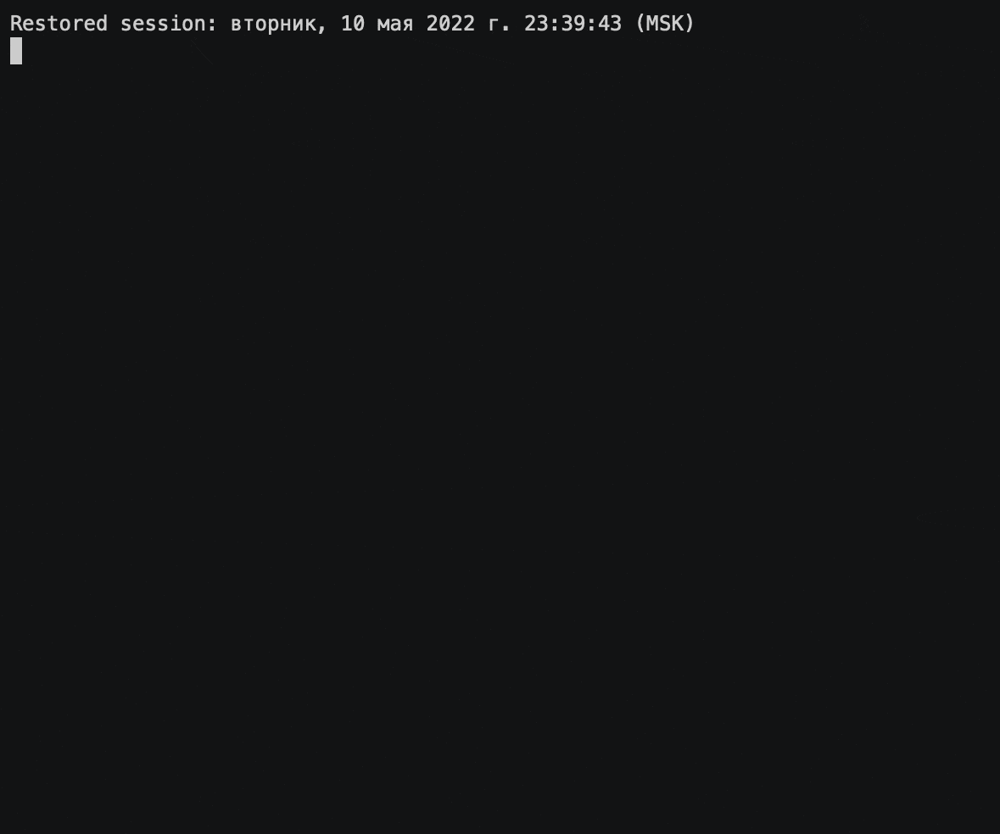
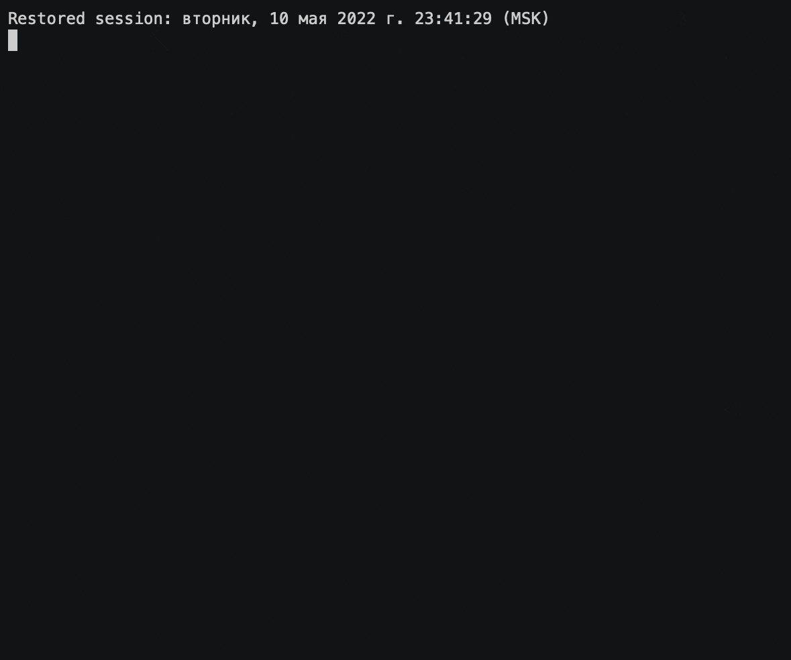

# Brain Games

[](https://github.com/pavelpminaev/python-project-lvl1/actions)
[](https://codeclimate.com/github/pavelpminaev/python-project-lvl1/maintainability)
[](https://github.com/pavelpminaev/python-project-lvl1/actions/workflows/github-actions.yml)

## Description
"Brain games" - is a set of five console games based on the principle
popular mobile applications for brain training.
Each game asks questions that need to be answered correctly.
After three correct answers, the game is considered to be completed.
Wrong answers end the game and offer to play it again.
## Games: 
```brain-even``` - Definition of an even number.

```brain-calc``` - Arithmetic expressions to be evaluated.

```brain-progression``` - Search for missing numbers in a sequence of numbers.

```brain-gcd``` - Finding the Greatest Common Divisor.

```brain-prime``` - Definition of a prime number.

---

```bash
mvn clean install
```
```
mvn clean install
```

```bash
brain-even
```


```bash
brain-calc
```


```
brain-gcd
```


```brain-progression```


```brain-prime```

